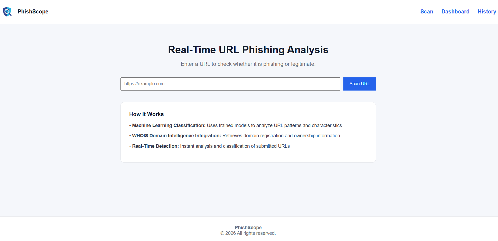
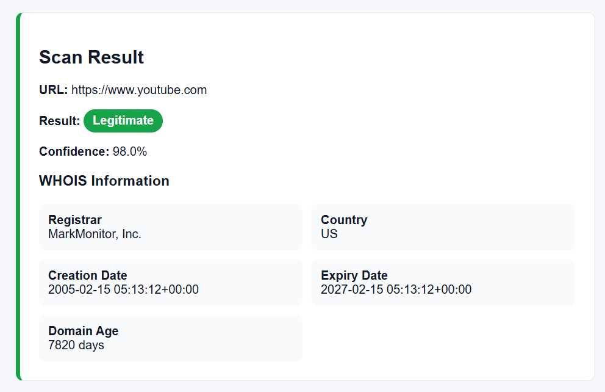
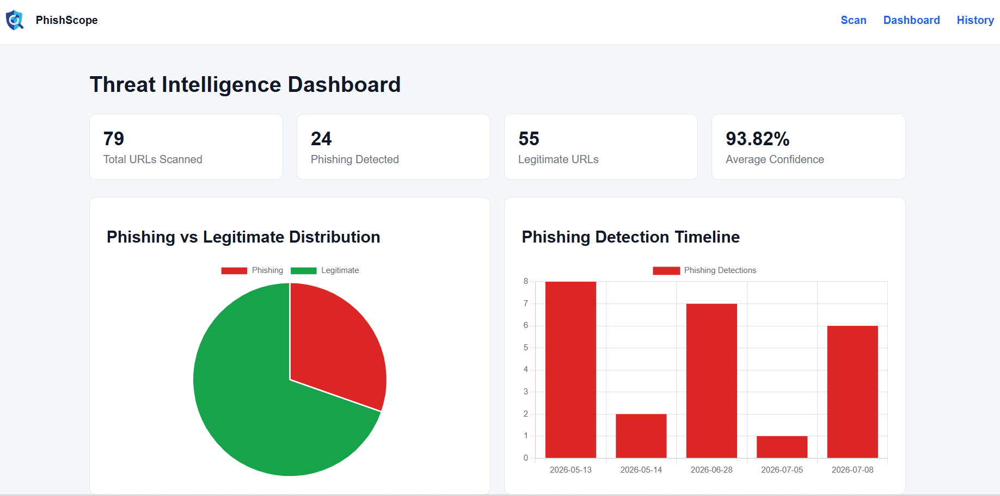
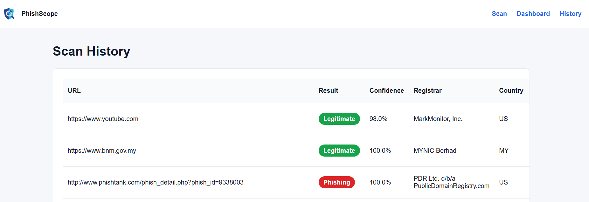

# AI-Powered Phishing Detection and Threat Intelligence Dashboard

## Overview

This project is a web-based phishing detection system developed as my Final Year Project for the Bachelor of Computer Science (Hons.) Cybersecurity program.

The application allows users to analyze URLs in real time using a Machine Learning model trained to distinguish between phishing and legitimate websites. It also retrieves WHOIS domain information and stores scan history for future reference.

---

## Features

- 🔍 Real-time URL phishing detection
- 🤖 Machine Learning prediction using Random Forest
- 🌐 WHOIS domain information lookup
- 📊 Scan history storage using SQLite
- 💻 Simple and user-friendly Flask web interface

---

## Technologies Used

### Backend
- Python
- Flask

### Machine Learning
- Random Forest
- Scikit-learn
- Joblib
- Pandas

### Database
- SQLite

### Frontend
- HTML
- CSS
- JavaScript

---

## Installation

### Clone the repository

```bash
git clone https://github.com/muhdluqman1000/AI-Powered-Phishing-Detection.git
```

### Install dependencies

```bash
pip install -r requirements.txt
```

### Run the application

```bash
python app.py
```

Open your browser and visit:

```
http://127.0.0.1:5000
```

---

## Machine Learning Model

The phishing detection model was trained using a balanced dataset consisting of phishing and legitimate URLs.

The model performs feature extraction from URLs before generating a prediction using a Random Forest classifier.

---

## Screenshots

### Home Page



### Prediction Result



### Dashboard Page



### History Page



---

## Author

Muhammad Luqman bin Abdul Ghafar

Bachelor of Computer Science (Hons.) Cybersecurity

Multimedia University (MMU)
